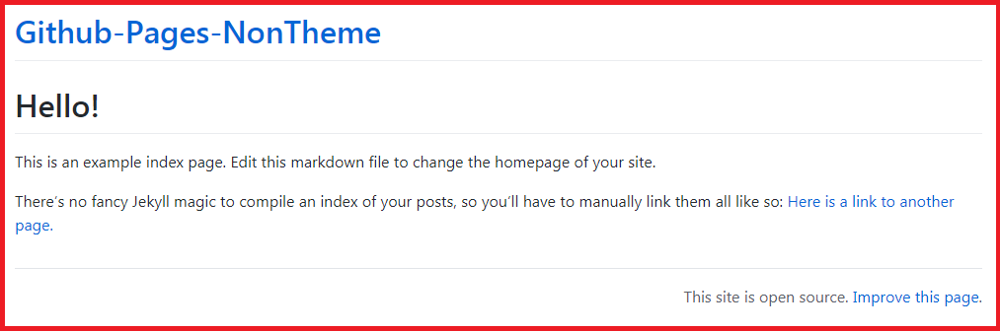

# Github Pages NonTheme Template
This is a template for a "themeless" Github Pages repo. Use this if you just want Github to render your markdown into html without *any* frills, but want to provide your own css styling.


## Using this repo as a site starter:
1. Create a new repo using this one as the template.
2. Go to the settings of your new repo, scroll down to the Github Pages section, and set the source to Branch:main
3. Edit the css. Either:
  - Edit the example.css file or
  - Change line 6 of `_layouts/default.html` to link to a different css stylesheet.
4. Edit the `_config.yaml` file to update the meta-info for your site.

## Making new pages.

Just create a new markdown file anywhere in your repo. As long as it isn't in a folder that starts with `_`, Jekyll will find it and turn it into an html file for you.

To make things work nicely, add a [Jekyll style front matter](https://jekyllrb.com/docs/front-matter/) to each markdown by starting the file with 

```
---
title: titleOfYourPageGoesHere
description: descriptionOfYourPageGoesHere
---
```

The title is what shows up in the `<title>` element of the resulting html page, while the description is just meta info that shows up in the header.

---

## The Problem

Github Pages automatically renders markdown files into webpages using Jekyll. By default, it uses the [Primer theme](https://github.com/pages-themes/primer), which looks something like this: 



Not bad, but what if you want something even simpler? Even something as minimal as the Primer theme has some fluff that can be trimmed:
- There's a fair bit of styling built in. About 75 kb worth.
- Every page has a header linking back to the homepage.
- If your pages repo has certain licenses, then every page has a footer linking to the repo on github.

These are all sensible features that you probably want most of the time. But again, what if you don't want?

## The solution

One option is to follow Primer's instructions to modify the layout and add your own supplemental styling.
That's essentially what I've done here, just with the goal of completely stripping everything out.

The `_layouts/default.html` file contains a liquid layout that does absolutely nothing to the page content except adding a title, and loading a css file. (`example.css` by default). It also contains some `<meta>` tags that add info which helps search engines and social media parse the page, but strictly speaking, that chunk doesn't need to be there.


